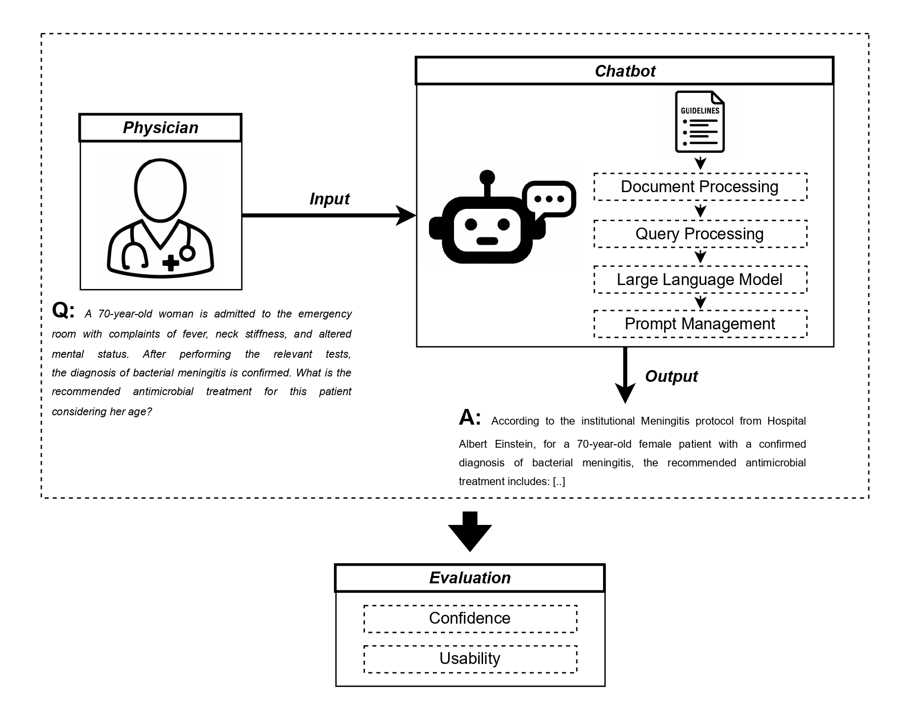

# Physicians’ Confidence and Usability of an AI Chatbot for Antimicrobial Stewardship: A Case Study at the Albert Einstein Hospital

This repository contains supporting materials for the study titled **"Physicians’ Confidence and Usability of an AI Chatbot for Antimicrobial Stewardship: A Case Study at the Albert Einstein Hospital"**.

## 🧾 Repository Structure

📁 chunks
 └─ *Manually generated chunks used in the chatbot (Portuguese)*

📁 fictitious-clinical-cases
 └─ *Fictitious clinical scenarios used for initial interactions with the assistant (Portuguese)*

📁 guidelines
 └─ *Official antimicrobial treatment guidelines used as reference for RAG (Portuguese)*

📁 figures
 └─ *Figures showing the chatbot-user interaction*

📁 prompt
 └─ *Full application prompt used in the chatbot (Portuguese)*